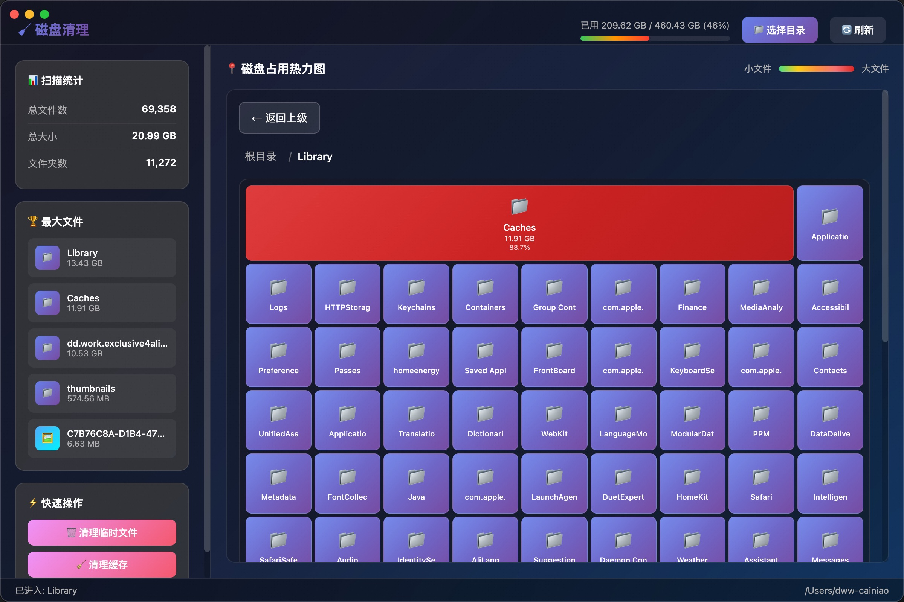

# Mac 磁盘清理工具

一款基于 Electron 开发的 Mac 磁盘清理软件，具有美观的 UI 界面和实用的文件管理功能。



## 功能特性

### 核心功能
- **磁盘扫描** - 递归扫描目录，分析文件大小和占用情况
- **树状图可视化** - 单一大方块布局，按文件占比显示不同大小
- **隐藏文件夹显示** - 支持显示以 `.` 开头的隐藏文件和文件夹
- **磁盘使用统计** - 实时显示磁盘总容量、已用空间和可用空间

### 文件管理
- **右键菜单** - 支持右键操作：打开、在 Finder 中打开、查看详情、删除
- **文件夹导航** - 点击进入文件夹，支持返回上级和面包屑导航
- **文件删除** - 支持删除文件和文件夹，删除后提示手动刷新
- **Finder 集成** - 一键在 Mac Finder 中定位文件

### UI 特性
- **现代化设计** - 深色主题，毛玻璃效果，渐变色块
- **7级颜色系统** - 从紫到深红，直观显示文件大小层级
- **响应式布局** - 自适应窗口大小，支持滚动浏览
- **动画效果** - 平滑的过渡动画和交互反馈

## 技术栈

- **Electron** - 跨平台桌面应用框架
- **Node.js** - 后端文件系统操作
- **HTML/CSS/JavaScript** - 前端界面
- **Flex 布局** - 树状图自适应布局

## 项目结构

```
disk-cleaner/
├── package.json          # 项目配置
├── src/
│   ├── main.js          # Electron 主进程
│   ├── index.html       # 主界面
│   ├── styles.css       # 样式文件
│   └── renderer.js      # 渲染进程逻辑
└── node_modules/        # 依赖包
```

## 安装与运行

### 安装依赖
```bash
cd disk-cleaner
npm install
```

### 启动应用
```bash
npm start
```

### 打包构建

> ⚠️ **注意**：打包后的应用文件较大（约 200MB+），这是因为 Electron 包含了 Chromium 内核。项目未提供预编译版本，请自行打包。

```bash
# 打包 Mac 版本（arm64 架构）
npm run build

# 或只生成目录，不打包 dmg
npm run build:mac:dir

# 打包输出位置
dist/mac-arm64/Disk Cleaner.app
```

**打包说明**：
- 仅支持 Mac 系统（arm64 架构）
- 需要安装 Node.js 和 npm
- 首次打包可能需要下载 Electron 依赖，请耐心等待

## 使用说明

### 基本操作
1. **选择目录** - 点击顶部"选择目录"按钮扫描指定文件夹
2. **查看文件** - 树状图中方块大小表示文件占用比例
3. **进入文件夹** - 点击文件夹方块进入查看内容
4. **返回上级** - 点击"返回上级"按钮或面包屑导航

### 右键菜单
在任意文件/文件夹方块上右键：
- **打开** - 在应用内进入文件夹
- **在 Finder 中打开** - 在 Mac Finder 中定位文件
- **查看详情** - 显示文件详细信息弹窗
- **删除** - 删除文件（需确认）

### 删除操作
- 删除后不会自动重新扫描
- 底部会显示刷新提示通知
- 可选择"立即刷新"或稍后手动刷新

## 界面说明

### 顶部工具栏
- 应用标题
- 磁盘使用进度条
- 选择目录/刷新按钮

### 左侧边栏
- 扫描统计（文件数、文件夹数、总大小）
- 最大文件列表
- 快速操作按钮

### 右侧主区域
- 树状图热力图
- 面包屑导航
- 返回按钮

### 底部状态栏
- 当前操作状态
- 当前路径显示

## 颜色说明

树状图使用7级颜色表示文件大小：

| 等级 | 颜色 | 说明 |
|------|------|------|
| Level 1 | 紫色 | 最小文件 |
| Level 2 | 蓝色 | 较小文件 |
| Level 3 | 绿色 | 中等文件 |
| Level 4 | 黄色 | 较大文件 |
| Level 5 | 橙色 | 大文件 |
| Level 6 | 红色 | 很大文件 |
| Level 7 | 深红 | 最大文件 |

## 注意事项

1. **权限问题** - 扫描系统目录可能需要管理员权限
2. **隐藏文件** - 默认显示隐藏文件，但跳过系统关键目录
3. **删除确认** - 删除操作不可撤销，请谨慎操作
4. **扫描深度** - 默认扫描4层目录深度

## 开发计划

- [x] 基础扫描功能
- [x] 树状图可视化
- [x] 右键菜单
- [x] Finder 集成
- [x] 删除后手动刷新
- [ ] 文件搜索功能
- [ ] 批量删除
- [ ] 文件预览
- [ ] 多语言支持

## 许可证

MIT License

## 作者

基于 Electron 开发的 Mac 磁盘清理工具
